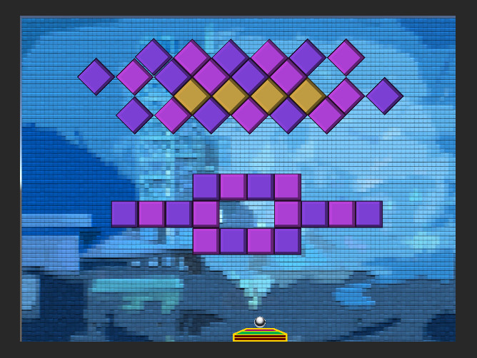

# Block Breaker

A classic brick-breaking arcade game built in Unity. Break all the blocks with a bouncing ball while keeping it in play with your paddle.




## Overview

Block Breaker is a modern take on the classic Breakout/Arkanoid-style game. Control a paddle to bounce a ball and destroy all the blocks on screen. Features multiple levels, power-ups, and increasing difficulty.

## Features

- **Classic Gameplay** - Paddle control, ball physics, block destruction
- **Multiple Levels** - Progressive difficulty with unique layouts
- **Physics System** - Realistic ball bouncing and collision detection
- **Score Tracking** - Points system and level progression
- **Game States** - Start menu, gameplay, win/lose screens
- **Audio** - Sound effects for hits, bounces, and block breaks

## Gameplay

- Control the paddle to keep the ball in play
- Break all blocks to complete the level
- Don't let the ball fall off the bottom
- Rack up points by breaking blocks

## Controls

- **Mouse / Arrow Keys** - Move paddle left and right
- **Space / Click** - Launch ball
- **ESC** - Pause menu

## How To Run

This is a Unity project:

1. Open the project in Unity
2. Navigate to `21.01/Assets/Scenes`
3. Open the main game scene
4. Press Play

## Project Structure

```
BlockBreaker/
├── 21.01/
│   ├── Assets/          # Game assets and scripts
│   ├── ProjectSettings/ # Unity configuration
│   └── *.sln           # Solution files
└── screenshots/         # Game screenshots
```

## Technologies

- **Unity Engine** - 2D game development
- **C#** - Game logic and scripting
- **Unity Physics 2D** - Collision and movement
- **Unity Audio** - Sound effects

## Game Mechanics

**Paddle**
- Mouse or keyboard controlled
- Ball launches from paddle
- Prevents ball from falling

**Ball**
- Physics-based movement
- Bounces off walls, paddle, and blocks
- Destroys blocks on contact

**Blocks**
- Different block types with varying durability
- Award points when destroyed
- Level complete when all blocks gone

---

*A classic arcade game reimagined in Unity*
